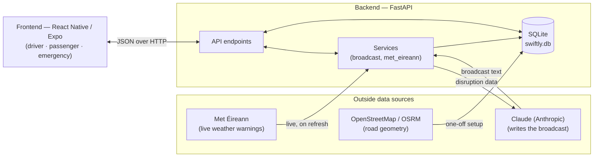

# Swiftly

**A trusted standard for severe weather road information.**

Swiftly is an AI-powered mobile app that turns scattered, unverified road-disruption reports into a single, trusted source drivers, passengers and emergency responders can act on, delivered hands-free, as a spoken route briefing.

Built as a capstone MVP by MSc Design & Development of Digital Business students at University College Cork, in partnership with Cian O'Brien, Emergency Management Officer at HSE South, on behalf of the Inter-Agency Emergency Management Office (IAEMO).

---

## The problem

There is no shared way to describe, verify, or remember road disruption(s).

Road condition information in Ireland is split across social media, official channels and commercial navigation apps, but nothing tells a driver *how sure* that information is or *where it came from*. Road users end up checking several platforms and still can't make a confident call. Emergency coordinators build informal databases from phone calls because no shared system exists across agencies. A single severe weather event costs Ireland an estimated €700 million in lost economic output, and Dublin drivers already lose ~95 hours a year to congestion, the highest rate in Europe.

The gap isn't a lack of data. It's the absence of a standard for **describing, verifying, updating, and retiring** disruption information, so more reports just mean more noise, not more clarity.

## The approach

Swiftly makes two distinctions visible everywhere in the product, instead of collapsing them into a single "there's a problem here" alert:

| Axis | What it captures |
|---|---|
| **Source** | `institutional` (Met Éireann warning, council notice) vs. `community` (a public report) |
| **Location certainty** | `stated` (the source named the exact road) vs. `inferred` (we matched the location ourselves, e.g. from a county-wide warning) |

A community report is visible to everyone immediately, clearly flagged **Unverified** — nothing is hidden. But it's held back from the spoken broadcast until emergency personnel confirm it. Once confirmed, it's voiced alongside official sources. That verification gate is the whole point of the project.

## What's in the app

One app, three roles, one shared dataset:

- **Driver**: hands-free and audio-first. A floating **Route Radio** button reads a Claude-generated spoken bulletin aloud, so the driver's eyes never leave the road.
- **Passenger**: browses the live map and alert list, and can file a **community report** against the road they're on.
- **Emergency personnel**: works the **pending-report queue**, confirms or updates disruptions, and coordinates with other responders.

Every alert carries the source and certainty it needs to be trusted: a colour-coded severity badge, a source badge (Met Éireann / Council / Community), and an update timeline showing how the disruption's status has changed over time. A live, colour-coded map and a week-ahead outlook round out the picture.

## How it's built



| Layer | Stack | Why |
|---|---|---|
| **Frontend** | React Native (Expo SDK 54), React Navigation, Leaflet + OpenStreetMap in a WebView, `expo-speech` | One codebase for iOS & Android; a free map with no API key; on-device text-to-speech |
| **Backend** | Python, FastAPI, Uvicorn, SQLite, Shapely | Fast to build, self-validating API contracts, zero-setup database for an MVP |
| **AI** | Claude (Anthropic API) | Turns structured disruption records into a natural, spoken-style bulletin, with a deterministic template fallback if no API key is set |
| **External data** | Met Éireann (via `PyMetEireann`), OSRM / OpenStreetMap | Live weather warnings; real road geometry for route setup |

Full write-ups of each side live in [`docs/Swiftly_Frontend_Documentation.md`](docs/Swiftly_Frontend_Documentation.md) and [`docs/Swiftly_Backend_Documentation.md`](docs/Swiftly_Backend_Documentation.md) — including the file-by-file map, every API endpoint, sequence diagrams for each data flow, and a full table of design trade-offs.

## Getting started

**Backend**

```bash
cd backend
python -m venv venv
source venv/bin/activate            # Windows: venv\Scripts\activate
pip install -r requirements.txt
cp ../.env.example .env             # then add your ANTHROPIC_API_KEY
python seed.py                      # loads the two demo routes + starter data
uvicorn main:app --reload
```

The API is now at `http://127.0.0.1:8000`, open `/docs` for an interactive test page of every endpoint.

**Frontend**

```bash
cd frontend
npm install
cp .env.example .env                # set EXPO_PUBLIC_API_BASE_URL if needed
npx expo start
```

Scan the QR code with Expo Go, or press `a` / `i` / `w` for Android, iOS or web. Point `EXPO_PUBLIC_API_BASE_URL` at your running backend (`http://localhost:8000` for web/emulator, your machine's LAN IP for a physical device).

> No `ANTHROPIC_API_KEY`? The backend still runs, broadcasts fall back to a plain-text template instead of a Claude-generated one.

## Project status

This is a three-week capstone MVP, not a production system. It deliberately trades scale and completeness for a reliable, demoable proof of the core idea:

- Two fixed, seeded routes (Cork–Killarney, Cork–Carrigaline), not arbitrary journeys
- SQLite, not a production-grade database
- Role selection is enforced in the UI, not yet by backend authentication
- Locally hosted; no live deployment

In testing with 11 participants, the app scored an average 7.9/10 for ease of use, and 9 of 11 said it would actually change how they travel around disruptions. See the [Final Sprint Report](docs/Final%20Sprint%20Report%202026_Student.docx) for the full write-up, including the business case and roadmap (live institutional data feeds, backend auth, dynamic GPS-based reporting, multilingual audio, and more).

## Team

Group 3, MSc Design & Development of Digital Business, University College Cork: Vanshika Juneja, Sai Shashank Sanjai Shankar, Clara Pei-yu Wang, Samyuktha Krishnan, Silvia Zverbikova.

Problem brief from Cian O'Brien, Emergency Management Officer, HSE South / IAEMO.
