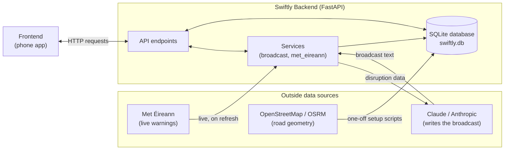
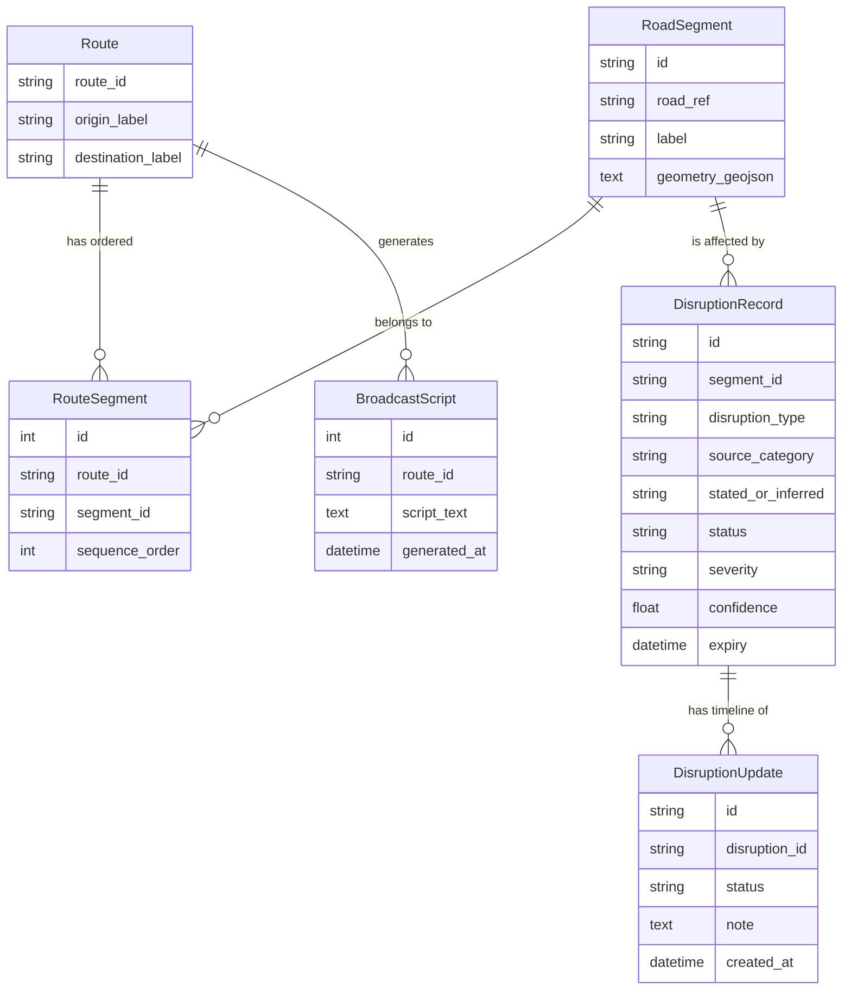
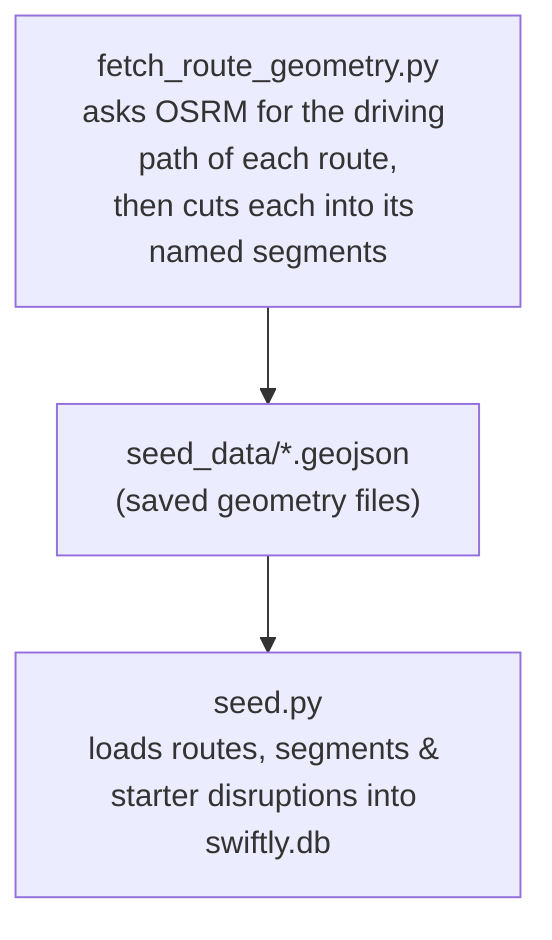
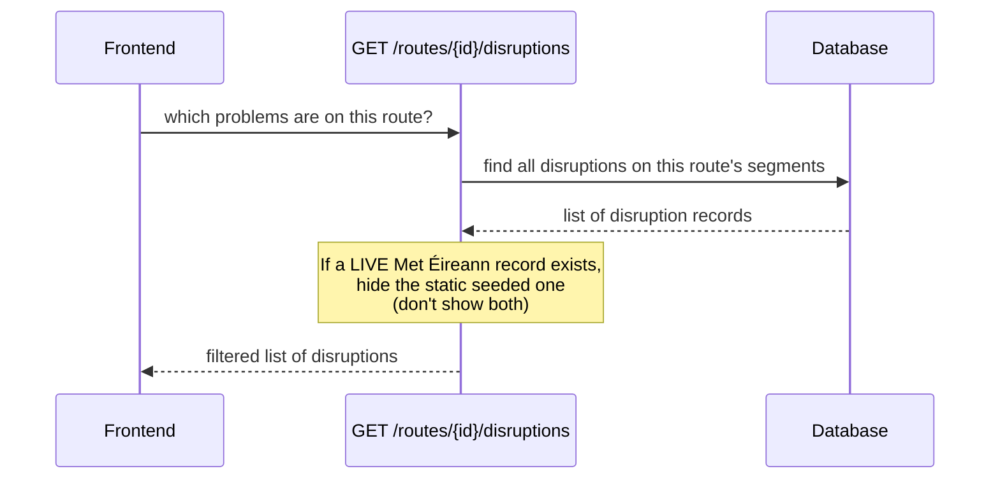
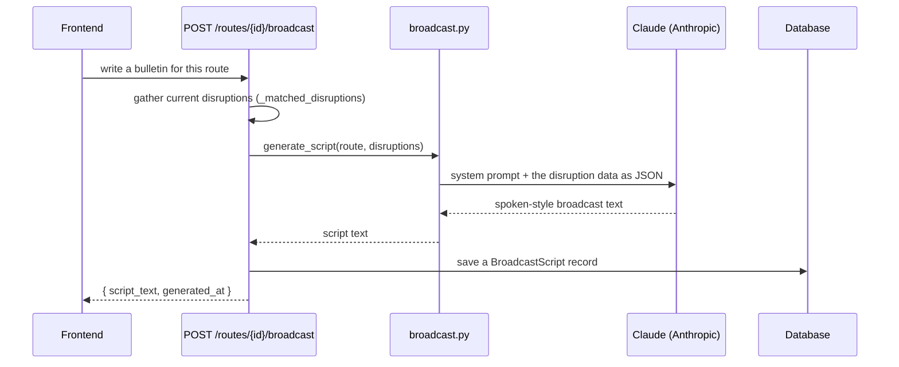
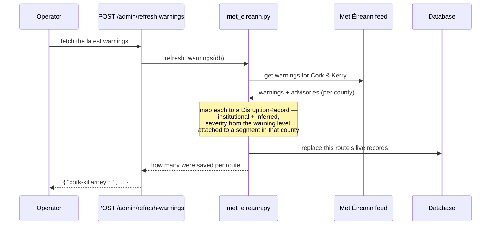
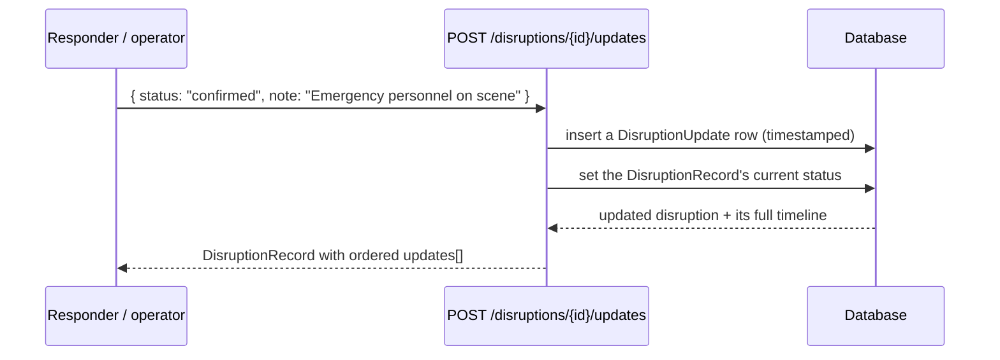
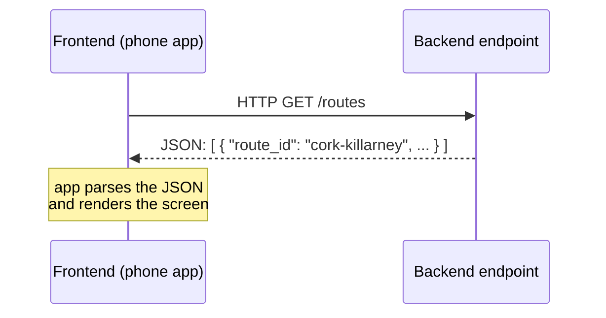

# Swiftly MVP Backend: How It Works

A plain-language guide to the backend: what it does, how it's put together, and how data flows through it. There's a [glossary](#glossary) at the end.

---

## Table of Content 

1. What the system does -- the traffic-bulletin idea in one paragraph
2. The core thesis -- institutional vs community, stated vs inferred, explained simply
3. Tech stack -- each tool with a one-line "what it is / why we use it"
4. The big picture -- a flowchart of the whole system + external services
5. File-by-file map -- with the "models = what data is / services = the hard work" rule of thumb
6. MVP Data model -- the six tables, with an entity-relationship diagram
7. API endpoints -- each URL in plain language, incl. GET-vs-POST explained
8. Dataflows -- sequence diagrams for setup, reading disruptions, broadcast generation (Claude), warning refresh, and the map overlay
9. How the AI is used -- what Claude does, and how the system prompt is designed
10. How data reaches the frontend -- JSON-over-HTTP, the schema contract, a per-screen table, the "frontend only sends a route_id" design point, and a CORS heads-up
11. Outside services -- which need keys (only Claude)
12. How to run the backend system locally
13. Design decisions & trade-offs -- a table of choices, each with why and what we gave up 
> Glossary -- every jargon term defined

---
## 1. What this system does

Swiftly takes **road disruptions** (a flood, a crash, a weather warning) from different sources, attaches each one to a stretch of a specific driving route, and then produces a short **spoken-style broadcast** that can be read out loud by text-to-audio function at the front-end; think of a live traffic bulletin, written automatically.

The backend is the "engine room". The MVP for now:

1. Stores two fixed driving routes and the real road geometry behind them. 
2. Stores disruptions affecting those routes.
3. Pulls **live weather warnings** from Met Éireann (Ireland's weather service).
4. Uses **Claude** (an AI model from Anthropic) to turn the raw disruption data into a readable broadcast.
5. Serves all of this to the frontend (the phone app) over a web **API**.

> **API** = Application Programming Interface. In practice it just means "a set of web addresses (URLs) the app can call to get or send data." Each such address is called an **endpoint**.

---

## 2. The core idea 

Not all disruption information is equal, and the system is built to make that visible. Every disruption is labelled on two axes:

- **Where it came from** -- `source_category`:
  - **institutional** (`met_eireann_warning`): an official body, e.g. a Met
    Éireann weather warning.
  - **community** (`community_report`): a member of the public reports the
    disruption directly, which emergency personnel may then confirm.
- **How sure we are about its location** -- `stated_or_inferred`:
  - **stated** -- the source named the exact road (high certainty).
  - **inferred** -- we matched the location ourselves (lower certainty). For example, Met Éireann issues a warning for a whole county, not a road, so we "infer" which road segments fall inside that county. 

> **Note on community reports:** in this MVP a *community report* is a
> public-user report that emergency personnel can confirm (see the update
> timeline in section 6). It is **not** MapAlerter -- MapAlerter is a Cork
> County Council service and is deliberately out of scope for the MVP.

The broadcast deliberately keeps this distinction audible ("an official warning, but the location is inferred…" vs "a community report naming the road
directly"). That contrast is the whole point of the project.

---

## 3. Tech stack: what each piece is

| Tool | What it is | Why we use it |
|---|---|---|
| **Python** | Programming language | The whole backend is written in it |
| **FastAPI** | A web framework | Turns Python functions into API endpoints |
| **Uvicorn** | A web server | Runs the FastAPI app so browsers/apps can reach it |
| **SQLite** | A tiny database (one file, `swiftly.db`) | Stores routes, segments, disruptions |
| **Anthropic SDK** | Claude API client | Generates the broadcast text |
| **PyMetEireann** | A library | Fetches live Met Éireann weather warnings |
| **Shapely** | A geometry library | Cuts road lines into named segments |

---

## 4. The big picture



---

## 5. File-by-file map

```
backend/
├── main.py              # App entry point that starts FastAPI, wires everything up
├── config.py            # Loads settings from .env (API keys, model name)
├── database.py          # Sets up the database connection
├── models.py            # The database tables, defined as Python classes
├── schemas.py           # The exact shapes of API responses (validation)
├── seed.py              # Fills the empty database with starting data
│
├── routers/
│   └── routes.py        # All the API endpoints live here
│
├── services/            # Where the external services are called
│   ├── broadcast.py     # Calls Claude to write the broadcast
│   └── met_eireann.py   # Fetches live warnings and saves them as disruptions
│
├── scripts/             # One-off tools in the MVP, run by hand, not part of the live app
│   └── fetch_route_geometry.py     # Builds both routes' geometry via OSRM, cut into named segments
│
└── seed_data/           # The processed road geometry, saved as GeoJSON files
```

> **GeoJSON** = a standard text format for geographic shapes. A road is stored as a `LineString`: a list of `[longitude, latitude]` points that, joined up, trace the road on a map.

**Rule of thumb:** `models` = what the data *is*; `schemas` = what the API *returns*; `routers` = the *URLs*; `services` = the *hard work*; `scripts` = *setup tools you run once*.

---

## 6. The data model (what's stored)

Six tables, defined in [models.py](models.py):



In words:

- **Route** -- a journey, e.g. "Cork to Killarney". There are exactly two hardcoded in the MVP.
- **RoadSegment** -- one stretch of road, with its real map geometry. E.g. "Ballincollig to Macroom (Macroom Bypass)".
- **RouteSegment** -- the link table saying which segments make up which route, and in what order (a route is a sequence of segments).
- **DisruptionRecord** -- one problem on one segment, carrying the source and certainty labels from section 2, plus a `status` (`reported` -> `confirmed` -> `cleared`) holding its *current* state.
- **DisruptionUpdate** -- one entry in a disruption's **update timeline** (e.g. "14:35 reported", "14:54 confirmed by emergency personnel"). A disruption has many, ordered by time; this is what the frontend's alert screen renders as a timeline. *(Added after the original five-table design -- see the note below.)*
- **BroadcastScript** -- a saved copy of each broadcast Claude generated.

> **Design change -- update timeline (added post-v1).** The original data model
> had five tables and no per-disruption history: a `DisruptionRecord` carried a
> single `created_at` and no `status`, so the frontend could show *that* a
> disruption existed but not how it had progressed. To support the alert-screen
> timeline in the Figma prototype, we (a) restored the `status` field on
> `DisruptionRecord` and (b) added the **`DisruptionUpdate`** child table above.
> Everything else is unchanged; this is a purely additive extension.

---

## 7. The API endpoints

These are the URLs the frontend (or you, via the `/docs` test page) can call.
The first three are the **public contract** the frontend depends on; the rest are extras.

| Method + URL | Plain-language meaning |
|---|---|
| `GET /routes` | "List the available routes." |
| `GET /routes/{id}/disruptions` | "What problems are currently on this route?" (each includes its `status` and its `updates` timeline) |
| `POST /routes/{id}/broadcast` | "Write me a spoken bulletin for this route." |
| `GET /routes/{id}/geometry` | "Give me the road lines so I can draw the route on a map." |
| `GET /routes/{id}/overlay` | "Give me the road lines **plus** a per-segment problem summary, ready to colour on a map." |
| `POST /disruptions/{id}/updates` | "Add a timeline entry to this disruption (e.g. emergency personnel confirmed it) and advance its status." |
| `POST /admin/refresh-warnings` | "Go fetch the latest Met Éireann warnings now." (operator action, not used by the app) |

> **GET vs POST**: `GET` means "just give me information" (safe, read-only).
> `POST` means "do something / create something" (here: generate a broadcast, or refresh warnings). 

To try them live: run the server and open `http://127.0.0.1:8000/docs`. FastAPI auto-generates a clickable test page for every endpoint.

---

## 8. How data flows (the important journeys)

### 8a. Setup: getting road geometry into the database

This happens **once** for the MVP by hand, before the app is used. It's why the routes have real shapes on a map.



*Why a routing service?* You could instead ask OpenStreetMap for a road by its reference (e.g. "everything tagged N22"). That works for national roads, which are tagged fully. But regional roads like the R613 have city sections tagged 
only by street name, so the reference query returns a broken, half-missing line. 
So instead, we asked a **routing service** (Open Source Routing Machine) for the driving path between waypoints gives a complete, continuous route for either kind of road, so both are built the same way. (An earlier version used two separate OpenStreetMap-based scripts; they were now replaced by this single one.) 

### 8b. Reading disruptions (with the "live overrides seed" rule)



The filtering lives in one shared helper, `_matched_disruptions`, so both the disruptions endpoint and the broadcast endpoint always agree on what "current problems" means.

### 8c. Generating a broadcast (this is where Claude comes in)



The **system prompt** (in [broadcast.py](services/broadcast.py)) is a fixed set
of instructions that teaches Claude the meaning of each field and the golden
rule: *keep the institutional-vs-community and stated-vs-inferred distinction
audible.* If no Claude API key is configured, the service falls back to a simple
template so the endpoint still works.

### 8d. Refreshing live Met Éireann warnings



Key points:

- Met Éireann warns **per county**, not per road, so we map the route's counties (Cork, Kerry) onto a representative segment, which is the "inferred" step.
- Live records are marked with an `id` starting `live-metie-` so the read layer (8b) can let them **override** the hand-written seed record.
- If there are **no** live warnings (e.g. calm weather), the seeded record simply stays as a fallback, so the demo is never empty.

### 8e. The map overlay

`GET /routes/{id}/overlay` combines 8b's disruption list with the segment geometry and returns one **GeoJSON FeatureCollection**. Each segment becomes a map feature whose `properties` say `worst_severity`, `has_institutional`, `has_community`, etc., including everything the map needs to draw each stretch and colour it by how bad and what kind of problem it has, in a single request.

### 8f. The disruption update timeline

Each disruption returned by 8b carries a `status` and an ordered `updates` list, so the alert screen can show a timeline ("14:35 reported -> 14:54 confirmed by emergency personnel"). New entries are appended via `POST /disruptions/{id}/updates`, which also advances the parent record's current `status`.



The frontend re-reads 8b (`GET /routes/{id}/disruptions`) to render the timeline; the `updates` are already nested in that response, so no extra call is needed just to display it.

---

## 9. How Claude (the AI) is used, and how the prompt is designed

AI is used in exactly **one** place in the backend: writing the broadcast. 
Everything else (storing routes, matching disruptions, fetching warnings, serving the map) is ordinary code. When you call `POST /routes/{id}/broadcast`, the current disruptions are handed to **Claude** (a large language model from Anthropic), which writes them up as a short spoken bulletin. The code lives in [broadcast.py](services/broadcast.py). 

### Why an LLM instead of a fixed template?

A template ("`{severity}` `{hazard}` on `{segment}`…") would be simpler, and one exists as a fallback. But an LLM does things a template can't:

- **Reads naturally aloud** -- full sentences a responder can actually speak, not robotic field-slotting.
- **Preserves nuance** -- it hedges low-confidence items ("possible", "unconfirmed") and states high-confidence ones plainly.
- **Summarises several problems** -- with two or three disruptions it writes a flowing bulletin, and can even connect related ones (e.g. "delays *building behind* the collision").
- **Adapts** -- one disruption or five, weather or crash, it copes without new code.

The trade-off: it costs a little money and time per call, and the wording isn't identical every time (see section 13). 

### How the call is made

`generate_script()` sends Claude two things:

1. A **system prompt** -- fixed instructions about *how* to write (never changes).
2. A **user message** -- the data for the user's route: origin &destination plus the list of disruptions, as **JSON**.

```
system:  "You are the broadcast writer for Swiftly… <rules> …"
user:    "Write the broadcast for the following route and disruption records:
          { "route": {...}, "disruptions": [ {...}, {...} ] }"
```

Keeping the instructions (system) separate from the data (user) matters: the instructions stay constant, and the data is clearly labelled as *content to describe*, making it a simple guard against the data accidentally (or maliciously) being read as new instructions. 

> **System prompt** = a block of instructions given to the model before the user's input, setting its role and rules.

### How the system prompt is designed 

The system prompt (in [broadcast.py](services/broadcast.py)) has four parts, each doing a specific job:

1. **A role.** *"You are the broadcast writer for Swiftly… for Irish emergency personnel… spoken-radio-style."* This sets the voice and audience.

2. **A data dictionary.** It explains what each field *means* that 
   `met_eireann_warning` is institutional/official while `community_report` is a public report (which emergency personnel may confirm); that `inferred` means the location was derived and is less certain.
   This is what "scoping the prompt to the schema" means: the model is taught to read our exact data correctly instead of guessing.

3. **The rules for the bulletin**, above all the **golden rule**:

   > *Make the provenance audible: say whether it is an official/institutional warning or a community report, and whether the location is confirmed (stated) or inferred. This distinction is the point of the system -- never drop it.*

   Plus: open by naming the route; give hazard, segment and severity; hedge by confidence; **plain text only** (no markdown/headings, because it is read aloud).

4. **A guardrail.** *"Do not invent disruptions or details beyond the records provided."* This keeps the model from inventing hazards that aren't in the data, especially critical when the output could inform real responders.

The principle throughout: **the prompt encodes the project's thesis.** The one thing the system most wants that institutional-vs-community and stated-vs-inferred stay visible,  written as an explicit, non-negotiable rule, so the AI can't smooth it away.

### The fallback (no key, no AI)

If `ANTHROPIC_API_KEY` isn't set, `generate_script()` skips Claude and uses a deterministic template (`_fallback_script`) that still labels each disruption's source and certainty. The endpoint always works; only the polish differs. 

### A note on data & privacy

Only disruption data (hazard type, source, severity, road segment, the warning text) is sent to Anthropic. **No personal data** is involved in script generation. The routes and warnings are public information.

---

## 10. How the data reaches the frontend

Everything travels as **JSON over HTTP**. JSON is just structured text (lists and `{ "key": value }` objects); HTTP is the ordinary "request -> response" mechanism the browsers use. The frontend asks a URL a question, the backend answers with a block of JSON, and the app reads it.



**The response shapes are guaranteed.** [schemas.py](schemas.py) defines the exact fields and types of every response (using a library called Pydantic).
FastAPI checks each response against these before sending it, so the frontend can rely on the field names never changing shape unexpectedly. The human-readable version of this "contract" lives in [docs/api-contract.md](../docs/api-contract.md), which is the agreed format between the backend and frontend developers. 

**How each screen uses an endpoint:**

| Frontend screen / action | Calls | Uses the response to… |
|---|---|---|
| Route picker | `GET /routes` | list the two journeys to choose from |
| Disruption list | `GET /routes/{id}/disruptions` | show each problem with a **source badge** (institutional vs community) and severity |
| Alert detail / timeline | `GET /routes/{id}/disruptions` | render each disruption's `status` and its `updates` list as a time-stamped **update timeline** |
| Confirm / update a disruption | `POST /disruptions/{id}/updates` | append a timeline entry (e.g. "confirmed by emergency personnel") and advance its status |
| "Generate broadcast" button | `POST /routes/{id}/broadcast` | display the returned `script_text` |
| Map view | `GET /routes/{id}/overlay` | draw each road segment and **colour it** by `worst_severity` + source |

**One deliberate design point:** the frontend never sends free text to the backend. It only ever sends back a `route_id` that it originally got from `GET /routes`. This keeps the two halves loosely coupled, so that the frontend doesn't need to know anything about roads, weather, or Claude; it just picks a route and renders whatever JSON comes back.

> **Note (CORS):** a React Native app talks to the API directly with no problem. If the frontend is ever run in a **web browser** (e.g. Expo web), the browser will block cross-origin calls until a small piece of "CORS middleware" is added to `main.py`. It isn't configured yet, which now is perceived as a known, one-line gap noted for later.

---

## 11. Outside services the backend talks to

| Service | When | Needs a key? |
|---|---|---|
| **Open Source Routing Machine (OSRM)** | One-off setup only, for both routes' geometry | No |
| **Met Éireann** (via PyMetEireann) | Live, when `/admin/refresh-warnings` is called | No |
| **Claude / Anthropic** | Live, when a broadcast is generated | **Yes** — `ANTHROPIC_API_KEY` in `.env` |

Only Claude needs a key. If it's missing, broadcasts fall back to a template.

> The backend no longer calls the OpenStreetMap **Overpass API** directly. The earlier scripts that did were replaced by the single OSRM-based one. OSRM uses OpenStreetMap map data internally, so OpenStreetMap is still the ultimate source of the road geometry; we just don't query Overpass ourselves anymore.

---

## 12. How to run backend locally

```bash
cd backend
python -m venv venv                 # once: create an isolated Python environment
venv\Scripts\activate               # Windows (use source venv/bin/activate on Mac/Linux)
pip install -r requirements.txt     # install dependencies
copy ..\.env.example .env           # then paste your ANTHROPIC_API_KEY into .env
python seed.py                      # fill the database with starter data
uvicorn main:app --reload           # start the server
```

Then open **`http://127.0.0.1:8000/docs`** to try every endpoint in the browser.

The database (`swiftly.db`) is created automatically and is safe to delete; just re-run `python seed.py` to rebuild it.

---

## 13. Design decisions & trade-offs

This is an MVP (Minimum Viable Product) built to a fixed 3-week scope, so many choices favour **simplicity and a reliable demo** over scale or completeness.

The main ones, and what we gave up:

| Decision | Why we did it | Trade-off / what we gave up |
|---|---|---|
| **SQLite** (one local file) as the database | Zero setup, no server to run, perfect for two fixed routes | Not built for many simultaneous users or heavy load. Need to swap to PostgreSQL for production |
| **Two fixed routes, no route-finding** | Keeps scope tiny; lets us focus on the data-source thesis | The app can't handle arbitrary journeys; only the two seeded routes exist |
| **Seed data + live-fallback** rather than fully live | The demo always shows an institutional-vs-community contrast, even in calm weather | Some data is hand-written, so it's not 100% "real" all the time |
| **Claude generates the broadcast** (vs a fixed template) | Natural, readable bulletins that preserve nuance (certainty, source) | Costs money per call, adds latency, and output isn't identical each time. A template fallback exists for when there's no API key |
| **Operator-triggered warning refresh** (`/admin/refresh-warnings`) rather than live-on-every-read or a scheduled job | Predictable and easy to demo ("press the button, real warnings appear"); no background machinery | Data is only as fresh as the last manual refresh |
| **Static county -> segment map** for inferring warning locations | Simple and honest for an MVP | Less precise than true geometric matching against county boundary shapes (noted as future work) |
| **Both routes built from a routing service (OSRM)** instead of OSM `ref` tags | One uniform pipeline; OpenStreetMap under-tags regional roads (the R613's city sections were missing), so a routing service gives a complete line for either road type | The line follows the *driving route* between waypoints rather than being a pure "every piece tagged with this ref" trace |
| **Sync endpoints wrapping an async fetch** (`asyncio.run` inside `met_eireann.py`) | Kept the whole codebase in one simple synchronous style | Slightly less efficient under high concurrency than a fully async design |
| **One representative segment per inferred warning** (not every segment in the county) | Cleaner, less noisy broadcasts and map | A county-wide warning is shown on one stretch, not literally everywhere it applies |
| **Advisories included, ranked below Warnings** | Ireland almost always has some advisory active, so the live demo rarely comes up empty | Slightly more "noise"; advisories are lower-value than colour-coded warnings |
| **New endpoints are additive; the original 3 never changed** | The frontend developer's existing work never breaks | The API surface grows over time rather than staying minimal |
| **Overlay bundles geometry + disruptions together** | The map gets everything it needs in **one** request, with no client-side joining | The response is larger and a little "denormalised" (some data restated) |

The throughline: every trade-off buys **less complexity now** at the cost of **less flexibility later**, which we believe is the right call for a capstone MVP whose goal is to demonstrate the idea, not to run in production.

---

## Glossary

- **API** -- a set of web addresses the app calls to get or send data.
- **Endpoint** -- one such address (a URL + method like `GET`/`POST`).
- **FastAPI / Uvicorn** -- the framework and server that run the API.
- **ORM (SQLAlchemy)** -- lets us use database rows as Python objects.
- **Schema** -- the exact expected shape of an API response.
- **GeoJSON / LineString** -- a text format for map shapes; a road is a list of
  points.
- **Segment** -- one stretch of road; a route is an ordered list of segments.
- **Institutional vs community** -- official source vs public report.
- **Stated vs inferred** -- exact location given vs location we worked out.
- **Seed data** -- the starting data loaded into an empty database.
- **System prompt** -- the fixed instructions given to Claude before the data.
```
