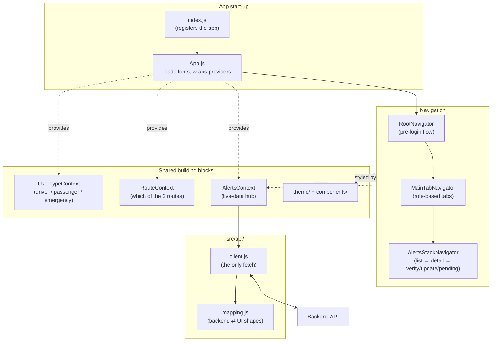
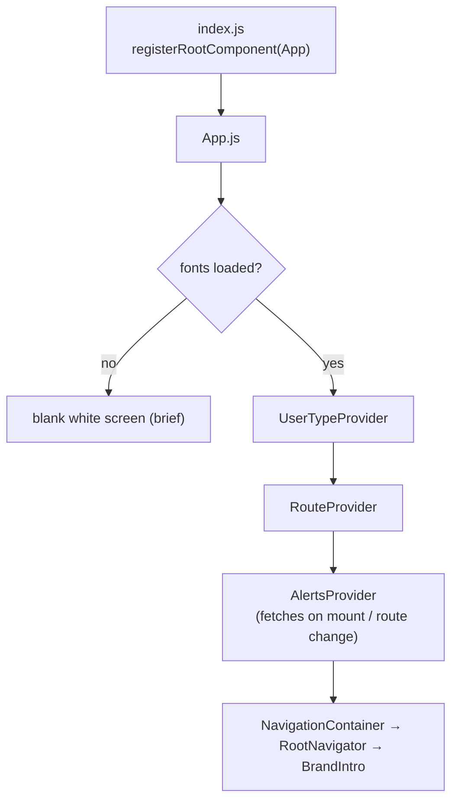
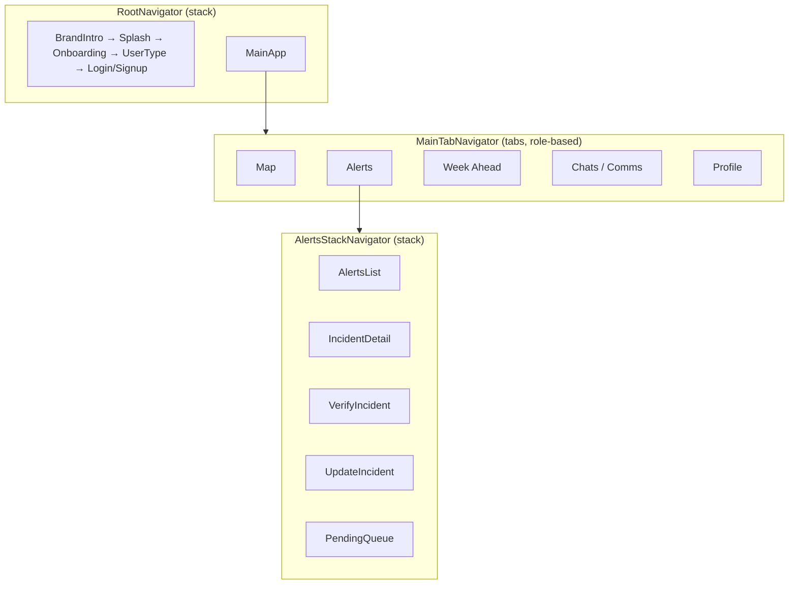
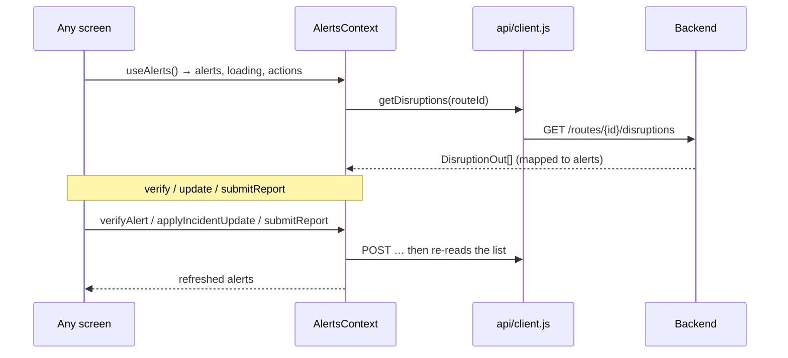

# Swiftly MVP Frontend: How It Works

A plain-language guide to the frontend: what it is, how it's put together, how a user moves through it, and how it talks to the backend. There's a [glossary](#glossary) at the end.

---

## Table of Content

1. What the frontend is -- the phone app in one paragraph
2. The core idea -- one app, three roles, driven by a single stored "user type"
3. Tech stack -- each tool with a one-line "what it is / why we use it"
4. The big picture -- how the pieces fit together
5. File-by-file map -- with the "screens = pages / components = reusable parts / api = the backend seam" rule of thumb
6. How the app boots -- from `index.js` to the first screen
7. Navigation -- the navigators and how they nest
8. The screens -- each one in plain language, grouped by the flow
9. The design system -- colours, typography, spacing pulled from Figma
10. State & data -- the role context, the route context, and the live-data hub
11. How the app talks to the backend -- the API client, the mapping layer, per-screen wiring
12. How the map works -- Leaflet in a WebView, drawing the live route overlay
13. How to run the frontend locally
14. Design decisions & trade-offs -- a table of choices, each with why and what we gave up
> Glossary -- every jargon term defined

---

## 1. What the frontend is

Swiftly's frontend is the **phone app** users actually see and tap. It's built with **React Native** and **Expo**, so one codebase runs on both iOS and Android. It walks a new user through onboarding, lets them pick a **role** (driver, passenger, or emergency personnel), and then drops them into the main app: a live **map**, a list of road **alerts**, a **week-ahead** outlook, and a **profile**.

The app is now **wired to the live backend**. Alerts, the map overlay, the audio broadcast, report submission and emergency verification all come from real API calls to the [backend](../backend/Swiftly_Backend_Documentation.md) (see sections 10–11). The one thing that is still mock is the **Week Ahead** outlook, which has no backend endpoint yet.

> **Expo** = a toolkit built on top of React Native. It handles the hard native build/packaging work so you can run the app on your phone (via the Expo Go app) just by scanning a QR code.

---

## 2. The core idea

Swiftly is **one app that reshapes itself around who is using it**. On the very first flow the user chooses a role on the [User Type screen](src/screens/auth/UserTypeScreen.js), and that single choice changes the rest of the experience:

- **Driver** -- hands-free, audio-first. The lightest set of tabs (no chat / no report entry), because the driver's eyes should stay on the road. Gets **Route Radio** (spoken broadcast).
- **Passenger** -- has time to look around: browse, **report** and track disruptions. Gets an extra **Chats** tab.
- **Emergency personnel** -- works with **verified** disruption data and team coordination. Gets a **Comms** tab, a **Verify / Update** flow, and a **pending-review queue**.

The role is stored **once, globally**, in a small piece of shared state ([UserTypeContext](src/context/UserTypeContext.js)). Any screen can read it without it being passed down through every navigation call. The [main tab bar](src/navigation/MainTabNavigator.js) reads that value and shows a different set of tabs per role.

This mirrors the backend's thesis (see the [backend doc](../backend/Swiftly_Backend_Documentation.md), section 2): the **verified-vs-unverified** and **institutional-vs-community** distinctions are made visible to the user. A community report is shown to everyone flagged **Unverified** until emergency personnel confirm it; every alert carries a [SourceBadge](src/components/SourceBadge.js) (Met Éireann / Council / Community, plus confirmed-vs-inferred location).

---

## 3. Tech stack: what each piece is

| Tool | What it is | Why we use it |
|---|---|---|
| **React Native** | A framework for building native mobile apps in JavaScript | One codebase runs on both iOS and Android |
| **Expo (SDK 54)** | A toolkit/runtime on top of React Native | Run on a real phone with no native build setup; handles fonts, assets, config |
| **React 19** | The UI library React Native is built on | Components, state (`useState`), context |
| **React Navigation** | The routing library for the app | Moving between screens: stacks + a bottom tab bar |
| **`fetch`** (built in) | The browser/RN HTTP function | Talks to the backend — wrapped in one API client, no extra HTTP library added |
| **react-native-webview** | Renders a web page inside the app | Hosts the Leaflet map without a paid native map SDK |
| **Leaflet + OpenStreetMap** | A free web mapping library + free map tiles | Draw the map (and the route overlay) with no API key and no billing |
| **expo-speech** | On-device text-to-speech | Reads the Route Radio broadcast aloud, hands-free |
| **react-native-svg** | Draws vector shapes | Custom graphics like the wave header |
| **expo-font + Google Fonts** | Loads custom fonts | Plus Jakarta Sans (headings), Poppins (body), Aboreto (logo) |

No HTTP library (axios etc.) was added — the app uses the built-in `fetch`, centralised in one file.

---

## 4. The big picture



---

## 5. File-by-file map

```
frontend/
├── index.js              # The very first file to run; registers the app with Expo
├── App.js                # Loads fonts, sets up the three providers, hands off to navigation
├── app.config.js         # Expo config: app name, icons, env vars
├── .env.example          # Documents EXPO_PUBLIC_API_BASE_URL (the backend URL)
├── package.json          # Dependencies and the start/android/ios/web scripts
│
└── src/
    ├── api/              # The backend seam
    │   ├── client.js     # The ONE place fetch() appears; wraps every endpoint
    │   ├── mapping.js    # Translates backend DisruptionOut ⇄ the frontend alert shape
    │   └── routes.js     # The two fixed route ids + their demo report segments
    │
    ├── navigation/       # How the user moves between screens
    │   ├── RootNavigator.js         # The pre-login flow (brand intro → … → main app)
    │   ├── MainTabNavigator.js      # The bottom tab bar; tabs differ by role
    │   └── AlertsStackNavigator.js  # Alerts list → detail → verify / update / pending queue
    │
    ├── screens/          # One file per full "page"
    │   ├── auth/         # Everything before the main app (onboarding, login, signup)
    │   ├── shared/       # Map, Alerts, Incident detail, Week Ahead, Profile
    │   ├── driver/       # RouteRadioScreen (spoken broadcast)
    │   ├── passenger/    # ReportIncidentScreen + chat screens
    │   └── emergency/    # Verify / Update / Pending queue + comms screens
    │
    ├── components/       # Small reusable UI parts (Button, SeverityBadge, SourceBadge…)
    │
    ├── context/          # App-wide shared state
    │   ├── UserTypeContext.js       # Which role the user picked
    │   ├── RouteContext.js          # Which of the two fixed routes is selected
    │   └── AlertsContext.js         # The live-data hub (fetches + write actions)
    │
    ├── data/             # Remaining mock content (weekAhead only)
    │   └── weekAhead.js
    │
    └── theme/            # The design system, pulled from Figma
        ├── colors.js
        ├── typography.js
        ├── spacing.js
        └── index.js
```

**Rule of thumb:** `screens` = full *pages*; `components` = *reusable parts*; `navigation` = how you *move between* pages; `context` = *shared state* any page can read; `api` = the *backend seam* (the only place the network is touched); `theme` = the *design system*.

---

## 6. How the app boots



[index.js](index.js) is the entry point Expo calls; it registers [App.js](App.js) as the root. `App.js`:

1. **Loads the custom fonts**; shows a blank white screen until ready so text never flashes in the wrong font.
2. **Wraps the app in three providers, in order:** `UserTypeProvider` (role) → `RouteProvider` (selected route) → `AlertsProvider` (live alert data). The order matters: the alert hub reads the selected route, which is why `RouteProvider` sits outside it.
3. **Renders `NavigationContainer` → `RootNavigator`**, which decides the first screen.

---

## 7. Navigation

The app uses **stack** navigators (push/pop pages) and one **tab** navigator (the bottom bar).



- **[RootNavigator](src/navigation/RootNavigator.js)** -- the pre-login journey; ends by pushing `MainApp`.
- **[MainTabNavigator](src/navigation/MainTabNavigator.js)** -- reads the role and shows different tabs: driver 4 tabs, passenger 5 (adds **Chats**), emergency 5 (adds **Comms**).
- **[AlertsStackNavigator](src/navigation/AlertsStackNavigator.js)** -- inside the Alerts tab. Holds the list, incident detail, the emergency **Verify** and **Update** screens, and the emergency **Pending queue**.

---

## 8. The screens

### Auth / pre-login ([src/screens/auth/](src/screens/auth/))

Onboarding, `UserTypeScreen` (picks the role), login/signup, verify — a fully clickable pre-login flow.

### Main app ([src/screens/shared/](src/screens/shared/))

| Screen | What it does |
|---|---|
| `MapScreen` | The live map (Leaflet in a WebView). The search panel lists the **two fixed routes**; picking one draws that route's coloured overlay from the backend |
| `AlertsScreen` | The live list for the selected route: each alert shows a severity badge, a **source badge**, and its time. Pull-to-refresh; loading/empty states. Emergency users get a "Review pending reports" button |
| `IncidentDetailScreen` | One alert in full: location, reported/expires times, status, a **SOURCE** card, the description, and the **update timeline** (`updates[]`). Emergency users see Verify / Update actions |
| `WeekAheadScreen` | A 7-day outlook of weather + planned disruptions (**still mock** — no backend endpoint) |
| `ProfileScreen` | The user's profile / settings |

### Role-specific

| Screen | Role | What it does |
|---|---|---|
| `RouteRadioScreen` | Driver | Fetches `POST /routes/{id}/broadcast` and reads the returned `script_text` aloud with expo-speech |
| `ReportIncidentScreen` | Passenger | Files a community report: a fixed demo "current" spot + a hardcoded valid `segment_id`, disruption type, severity, description → `POST /routes/{id}/reports` |
| `VerifyIncidentScreen` | Emergency | Confirm or reject a report → `POST /disruptions/{id}/updates` |
| `UpdateIncidentScreen` | Emergency | Close / escalate / update an incident → `POST /disruptions/{id}/updates` |
| `PendingQueueScreen` | Emergency | The review queue from `GET /disruptions/pending`; confirm a report in place |

---

## 9. The design system

Everything visual comes from [src/theme/](src/theme/), pulled from the Swiftly **Figma** file. [theme/index.js](src/theme/index.js) bundles colours, typography and spacing into one `theme` object.

- **[colors.js](src/theme/colors.js)** -- scales named `50`→`950`; `primary` is the brand green, plus `red`/`orange`/`green` used for severity.
- **[typography.js](src/theme/typography.js)** -- Plus Jakarta Sans (headings), Poppins (body), Aboreto (logo).
- **[spacing.js](src/theme/spacing.js)** -- `spacing`, `radius`, `stroke` scales.

Two badge components carry the domain meaning:

- **[SeverityBadge](src/components/SeverityBadge.js)** -- a coloured dot + label, keyed by the **backend severity vocabulary** `high` (red) / `medium` (orange) / `low` (green), so live data maps straight through with no translation.
- **[SourceBadge](src/components/SourceBadge.js)** -- surfaces provenance: **Met Éireann / Council** (official) vs **Community** (public report), plus a "Confirmed location" / "Inferred location" note from `stated_or_inferred`. This is how the project's core thesis shows up in the UI.

---

## 10. State & data

Three React contexts, wrapped in `App.js`:

### Role state — [UserTypeContext](src/context/UserTypeContext.js)
Which role the user picked (`driver` / `passenger` / `emergency`). Defaults to `driver` for testing. The tab bar and per-screen actions read it.

### Route state — [RouteContext](src/context/RouteContext.js)
Which of the **two fixed backend routes** (`cork-killarney`, `cork-carrigaline`) is selected. The prototype hardcodes these ids rather than calling `GET /routes` — the backend only serves those two. Everything route-scoped (alerts, map, broadcast, reports) reads `selectedRouteId` from here.

### Live alert data — [AlertsContext](src/context/AlertsContext.js)
The single live-data hub. On mount and whenever the selected route changes, it fetches `GET /routes/{id}/disruptions`, maps each to the frontend alert shape, and exposes the write actions:



`useAlerts()` keeps the same surface the screens already used (`alerts`, `getAlert`, `verifyAlert`, `applyIncidentUpdate`), plus `submitReport`, `loading`, `error`, and `reload`.

The only remaining **mock** content is [data/weekAhead.js](src/data/weekAhead.js) (no backend endpoint yet).

---

## 11. How the app talks to the backend

Everything travels as **JSON over HTTP**, through one seam:

- **[api/client.js](src/api/client.js)** — the only place `fetch` appears. It reads the base URL from `EXPO_PUBLIC_API_BASE_URL` (Expo inlines `EXPO_PUBLIC_*` at build time; defaults to `http://localhost:8000`) and wraps every endpoint: `getDisruptions`, `getOverlay`, `getGeometry`, `getPending`, `submitReport`, `addUpdate`, `generateBroadcast`.
- **[api/mapping.js](src/api/mapping.js)** — the translation layer. `toAlert(disruptionOut)` builds the alert object screens read (title from `road_ref` + type, location from `segment_label`, the `updates[]` timeline, and the source/severity fields). It also maps status → display label: `reported → Unverified`, `confirmed → Verified`, `cleared → Cleared`.
- **[api/routes.js](src/api/routes.js)** — the two fixed route ids and, for each, the demo report location + a valid `segment_id`.

Per-screen wiring (all live):

| Frontend screen / action | Calls |
|---|---|
| Map overlay (coloured roads) | `GET /routes/{id}/overlay` |
| `AlertsScreen` list | `GET /routes/{id}/disruptions` |
| `IncidentDetailScreen` timeline | `updates[]` from the same disruptions response |
| Submit a report (passenger) | `POST /routes/{id}/reports` |
| Emergency pending queue | `GET /disruptions/pending` |
| Confirm / reject / update | `POST /disruptions/{id}/updates` |
| Route Radio (driver) | `POST /routes/{id}/broadcast` |

**The verification gate matches the backend:** an unconfirmed community report **is** shown on the list and map (flagged Unverified), but it's excluded from the spoken broadcast until emergency personnel confirm it (see the [backend doc](../backend/Swiftly_Backend_Documentation.md), section 8g).

> **Note (CORS):** running on a phone (Expo Go / native) talks to the API directly with no issue. Only if the app is run in a **web browser** (Expo web) would the backend need a small CORS middleware — a known one-line gap noted in the [backend doc](../backend/Swiftly_Backend_Documentation.md), section 10.

---

## 12. How the map works

[MapScreen](src/screens/shared/MapScreen.js) shows a real, interactive map **without any paid map SDK or API key**, by rendering an inline Leaflet + OpenStreetMap page inside a `react-native-webview`.

- When a route is selected, the screen fetches `GET /routes/{id}/overlay` (a GeoJSON `FeatureCollection` with per-segment `worst_severity`) and pushes it into the map via `injectJavaScript`, where `window.drawOverlay(...)` draws each segment coloured by severity (high=red, medium=orange, low/none=green) and fits the view to the route.
- The map signals readiness by posting a `map-ready` message, so the overlay is only injected once both the map and the data exist.
- A guard (`onShouldStartLoadWithRequest`) blocks the map from navigating away if someone taps the Leaflet attribution link.

---

## 13. How to run the frontend locally

```bash
cd frontend
npm install                       # install dependencies (once)
cp .env.example .env              # then set EXPO_PUBLIC_API_BASE_URL if needed
npx expo start                    # start the Expo dev server; shows a QR code
```

Point the app at a running backend via `EXPO_PUBLIC_API_BASE_URL`:

- **Web / Android emulator:** `http://localhost:8000`
- **Physical device (Expo Go):** the host machine's LAN IP, e.g. `http://192.168.1.20:8000`

Start the backend first (see the [backend doc](../backend/Swiftly_Backend_Documentation.md), section 12), then scan the QR code with **Expo Go**, or press `a` (Android) / `i` (iOS) / `w` (web).

> **Expo version note:** Expo changes fast. Before writing new code, check the exact versioned docs for the SDK in use — see [AGENTS.md](AGENTS.md).

---

## 14. Design decisions & trade-offs

This is an MVP built to a fixed scope, so many choices favour **a reliable, demoable app** over completeness.

| Decision | Why we did it | Trade-off / what we gave up |
|---|---|---|
| **Expo (managed) + React Native** | One codebase for iOS & Android; run on a real phone with zero native setup | Some native modules aren't available inside Expo Go |
| **Built-in `fetch`, one API client** | No extra HTTP dependency; every network call is in one auditable file | Manual response/error handling (no interceptors, retries, caching) |
| **Two fixed routes, hardcoded ids** (no `GET /routes` picker) | The backend only serves two seeded routes; a dropdown of two is enough | The app can't handle arbitrary journeys |
| **Report uses a demo spot + hardcoded `segment_id`** | No GPS/geocoding needed; the report always resolves to a real segment and never `422`s | Only works for the two seeded routes; a real segment picker is a later upgrade |
| **Severity re-keyed to `high/medium/low`** | Live backend data maps straight through with no translation | The Figma labels "Disrupted/Caution/Clear" became "High/Medium/Low" |
| **Reject = a `cleared` update with a note** | The backend status enum has no `rejected`; this records the decision without a backend change | "Rejected" isn't a distinct state — it reads as cleared-with-note |
| **AI-confidence UI kept as static demo text** | The backend has no AI-assessment field; deferred pending design | The Verify screen's confidence bar isn't backend-driven |
| **Leaflet in a WebView** (vs native map SDK) | Free, no API key, works in Expo Go; overlay pushed in via `injectJavaScript` | A WebView is heavier and passing data in is a bit more manual |
| **Week Ahead still mock** | No backend endpoint for it in this sprint | That one screen doesn't show live data |
| **Role/route state in React Context** (not persisted) | Any screen reads it directly | Reset on app restart — no `AsyncStorage` yet |

The throughline mirrors the backend: every trade-off buys **less complexity now** at the cost of features (persistence, auth, arbitrary routes) deferred to later.

---

## Glossary

- **React Native / Expo** -- framework + toolkit for building and running native apps from one JS codebase.
- **Component / Screen / Navigator** -- a reusable UI part / a full page / the thing that moves you between pages.
- **Context** -- React's way of sharing one value (role, selected route, alert data) with every screen.
- **API client** -- the single module (`src/api/client.js`) that makes every network call.
- **Mapping layer** -- `src/api/mapping.js`, which converts backend shapes/vocabulary into what the screens render.
- **Severity** -- how serious a disruption is, using the backend vocabulary: `high` (red), `medium` (orange), `low` (green).
- **Status** -- a disruption's lifecycle: `reported` (shown as Unverified), `confirmed` (Verified), `cleared`.
- **Source / provenance** -- where a disruption came from: Met Éireann or Council (official) vs Community (public report); shown by the SourceBadge.
- **Verification gate** -- an unconfirmed community report is visible everywhere as Unverified but is kept out of the spoken broadcast until confirmed.
- **WebView / Leaflet / OpenStreetMap** -- an embedded browser hosting a free map library and free tiles; no API key.
- **Role / user type** -- driver, passenger, or emergency personnel; chosen once, reshapes the app.
- **CORS** -- a browser security rule that can block web calls to another server; only relevant if the app runs in a browser.
