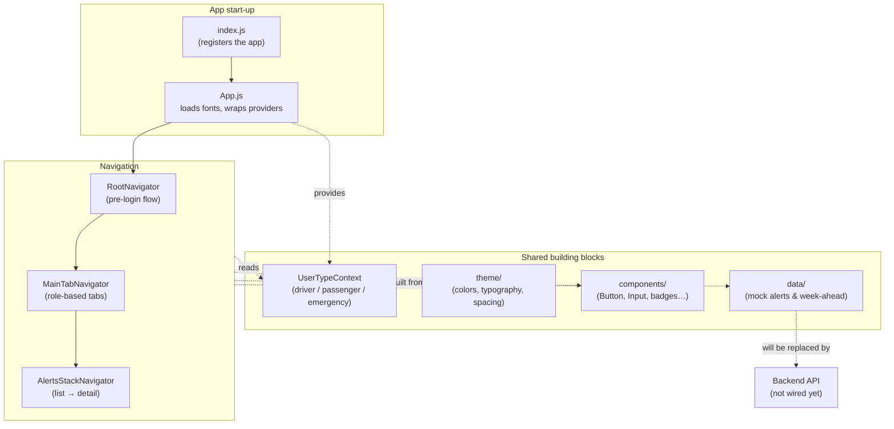
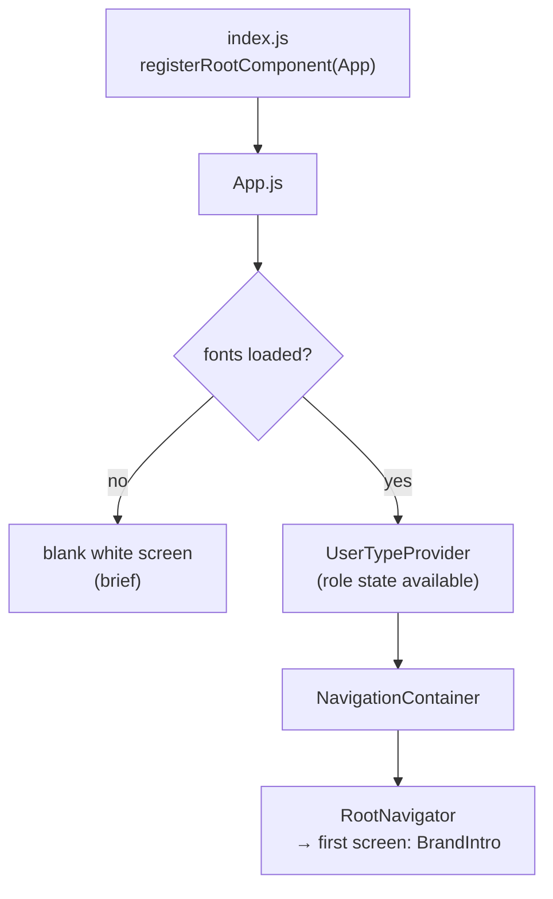
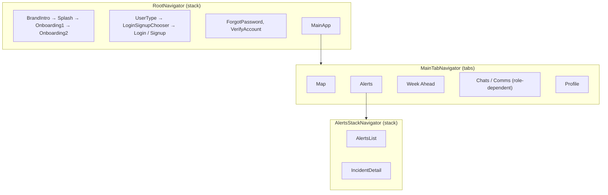
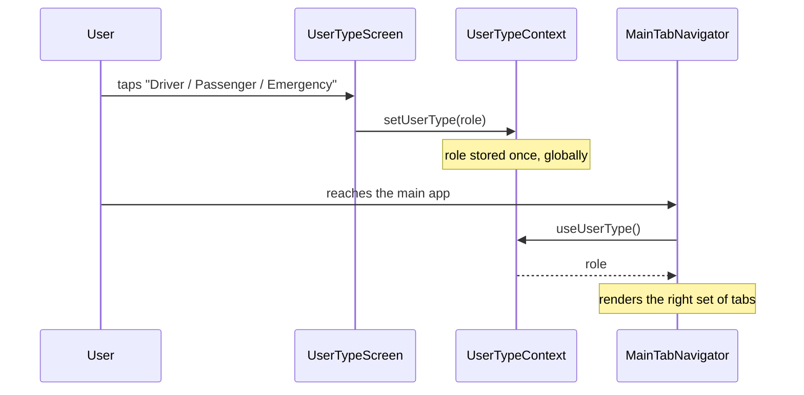

# Swiftly MVP Frontend: How It Works

A plain-language guide to the frontend: what it is, how it's put together, how a user moves through it, and how it will talk to the backend. There's a [glossary](#glossary) at the end.

---

## Table of Content

1. What the frontend is -- the phone app in one paragraph
2. The core idea -- one app, three roles, driven by a single stored "user type"
3. Tech stack -- each tool with a one-line "what it is / why we use it"
4. The big picture -- how the pieces fit together
5. File-by-file map -- with the "screens = pages / components = reusable parts / theme = the design system" rule of thumb
6. How the app boots -- from `index.js` to the first screen
7. Navigation -- the three navigators and how they nest
8. The screens -- each one in plain language, grouped by the flow
9. The design system -- colours, typography, spacing pulled from Figma
10. State & data -- the role context, and the mock data standing in for the backend
11. How the map works -- Leaflet in a WebView, no API key
12. How data will reach the backend -- the JSON-over-HTTP contract, and where each screen will plug in
13. How to run the frontend locally
14. Design decisions & trade-offs -- a table of choices, each with why and what we gave up
> Glossary -- every jargon term defined

---

## 1. What the frontend is

Swiftly's frontend is the **phone app** users actually see and tap. It's built with **React Native** and **Expo**, so one codebase runs on both iOS and Android. It walks a new user through onboarding, lets them pick a **role** (driver, passenger, or emergency personnel), and then drops them into the main app: a live **map**, a list of road **alerts**, a **week-ahead** outlook, and a **profile**.

Right now the app is a **fully clickable UI shell**. Every screen is built and navigable end-to-end, but the data it shows is still **hard-coded mock data** ([alerts.js](src/data/alerts.js), [weekAhead.js](src/data/weekAhead.js)) rather than live answers from the backend. Wiring those screens to the real [backend API](../backend/Swiftly_Backend_Documentation.md) is the next step (see section 12).

> **Expo** = a toolkit built on top of React Native. It handles the hard native build/packaging work so you can run the app on your phone (via the Expo Go app) just by scanning a QR code.

---

## 2. The core idea

Swiftly is **one app that reshapes itself around who is using it**. On the very first flow the user chooses a role on the [User Type screen](src/screens/auth/UserTypeScreen.js), and that single choice changes the rest of the experience:

- **Driver** -- hands-free, audio-first. The lightest set of tabs (no chat / no report entry), because the driver's eyes should stay on the road.
- **Passenger** -- has time to look around: browse, report and track disruptions. Gets an extra **Chats** tab.
- **Emergency personnel** -- works with **verified** disruption data and team coordination. Gets a **Comms** tab instead of Chats.

The role is stored **once, globally**, in a small piece of shared state ([UserTypeContext](src/context/UserTypeContext.js)). Any screen can read it without it being passed down through every navigation call. The [main tab bar](src/navigation/MainTabNavigator.js) reads that value and shows a different set of tabs per role.

This mirrors the backend's thesis (see the [backend doc](../backend/Swiftly_Backend_Documentation.md), section 2): the **verified-vs-unverified** distinction is made visible to the user. Emergency personnel confirm reports; everyone else sees them flagged as unverified. The [alerts](src/data/alerts.js) each carry a `status` of `Verified` or `Unverified` for exactly this reason.

---

## 3. Tech stack: what each piece is

| Tool | What it is | Why we use it |
|---|---|---|
| **React Native** | A framework for building native mobile apps in JavaScript | One codebase runs on both iOS and Android |
| **Expo (SDK 54)** | A toolkit/runtime on top of React Native | Run on a real phone with no native build setup; handles fonts, assets, config |
| **React 19** | The UI library React Native is built on | Components, state (`useState`), context |
| **React Navigation** | The routing library for the app | Moving between screens: stacks + a bottom tab bar |
| **react-native-webview** | Renders a web page inside the app | Hosts the Leaflet map without a paid native map SDK |
| **Leaflet + OpenStreetMap** | A free web mapping library + free map tiles | Draw the map with no API key and no billing |
| **react-native-svg** | Draws vector shapes | Custom graphics like the wave header |
| **expo-font + Google Fonts** | Loads custom fonts | Plus Jakarta Sans (headings), Poppins (body), Aboreto (logo) |

---

## 4. The big picture



---

## 5. File-by-file map

```
frontend/
├── index.js              # The very first file to run; registers the app with Expo
├── App.js                # Loads fonts, sets up providers, hands off to navigation
├── app.config.js         # Expo config: app name, icons, and env vars (apiBaseUrl…)
├── package.json          # Dependencies and the start/android/ios/web scripts
│
├── assets/               # App icons and splash images
│
└── src/
    ├── navigation/       # How the user moves between screens
    │   ├── RootNavigator.js         # The pre-login flow (brand intro → … → main app)
    │   ├── MainTabNavigator.js      # The bottom tab bar; tabs differ by role
    │   └── AlertsStackNavigator.js  # Alerts list → incident detail (tab bar stays)
    │
    ├── screens/          # One file per full "page"
    │   ├── auth/         # Everything before the main app (onboarding, login, signup)
    │   ├── shared/       # The main app: Map, Alerts, Incident detail, Week Ahead, Profile
    │   └── PlaceholderScreen.js     # A stand-in for screens not built yet
    │
    ├── components/       # Small reusable UI parts (Button, Input, badges, headers…)
    │
    ├── context/          # App-wide shared state
    │   └── UserTypeContext.js       # Which role the user picked
    │
    ├── data/             # Mock data standing in for the backend
    │   ├── alerts.js
    │   └── weekAhead.js
    │
    └── theme/            # The design system, pulled from Figma
        ├── colors.js
        ├── typography.js
        ├── spacing.js
        └── index.js      # Bundles the three into one `theme` object
```

**Rule of thumb:** `screens` = full *pages*; `components` = *reusable parts* shared across pages; `navigation` = how you *move between* pages; `context` = *shared state* any page can read; `data` = *stand-in* content (until the backend is wired); `theme` = the *design system* (colours, fonts, spacing) everything is styled from.

---

## 6. How the app boots



[index.js](index.js) is the entry point Expo calls; it just registers [App.js](App.js) as the root. `App.js` does three things, in order:

1. **Loads the custom fonts** (Plus Jakarta Sans, Poppins, Aboreto) with `useFonts`. Until they're ready it shows a blank white screen, so text never flashes in the wrong font.
2. **Wraps everything in `UserTypeProvider`**, so the chosen role is available to every screen (section 10).
3. **Wraps everything in `NavigationContainer`** and renders `RootNavigator`, which decides the first screen.

---

## 7. Navigation

The app uses **three navigators**, nested inside each other. Two kinds are used:

- A **stack** navigator = a pile of screens you push onto and pop off of (like browser back/forward).
- A **tab** navigator = the bottom bar with icons you tap to switch sections.



- **[RootNavigator](src/navigation/RootNavigator.js)** -- the whole pre-login journey, one screen at a time, headers hidden. It starts at `BrandIntro` and ends by pushing `MainApp`. Screens not built yet fall back to `PlaceholderScreen` so the flow is still fully clickable.
- **[MainTabNavigator](src/navigation/MainTabNavigator.js)** -- the bottom tab bar once you're in the app. It **reads the role** from context and shows different tabs: driver gets 4 tabs, passenger gets 5 (adds **Chats**), emergency personnel gets 5 (adds **Comms**). It's styled with the theme's brand green.
- **[AlertsStackNavigator](src/navigation/AlertsStackNavigator.js)** -- lives *inside* the Alerts tab. It exists so tapping an alert can push to a full **Incident Detail** screen while the bottom tab bar stays visible.

> **Why a stack inside a tab?** A tab on its own is a single screen. To let a tap open a deeper screen (Alerts → Incident Detail) *without* losing the tab bar, that tab needs its own little stack.

---

## 8. The screens

Grouped by where they appear in the flow.

### Auth / pre-login ([src/screens/auth/](src/screens/auth/))

| Screen | What it does |
|---|---|
| `BrandIntroScreen` | A ~1-second branded splash on cold start |
| `SplashScreen` | The animated intro splash (~2s) |
| `OnboardingScreen1` / `OnboardingScreen2` | The intro carousel explaining what Swiftly does |
| `UserTypeScreen` | **The key one:** pick driver / passenger / emergency; stores the role; expandable cards |
| `LoginSignupChooserScreen` | "Log in or sign up?" fork |
| `LoginScreen` / `SignupScreen` | Credential entry |
| `ForgotPasswordScreen` | Password-reset request |
| `VerifyAccountScreen` | Enter a verification code |

### Main app ([src/screens/shared/](src/screens/shared/))

| Screen | What it does |
|---|---|
| `MapScreen` | The live map (Leaflet in a WebView) with a search/route panel and a weather warning banner |
| `AlertsScreen` | The scrollable list of road alerts, each with a severity badge; taps push to detail |
| `IncidentDetailScreen` | The full detail for one alert: description, verification status, AI-verification note |
| `WeekAheadScreen` | A 7-day outlook of weather + planned disruptions |
| `ProfileScreen` | The user's profile / settings |

### Utility

| Screen | What it does |
|---|---|
| `PlaceholderScreen` | A labelled "coming soon" stand-in used wherever a real screen isn't built yet |

---

## 9. The design system

Everything visual comes from one place: [src/theme/](src/theme/), pulled straight from the Swiftly **Figma** file so the app matches the designs exactly. [theme/index.js](src/theme/index.js) bundles three files into one `theme` object you import everywhere:

```js
import { theme } from '../theme';
backgroundColor: theme.colors.primary[500]   // core brand green
...theme.typography.heading.h3               // a heading style
padding: theme.layout.spacing[4]             // 16px
```

- **[colors.js](src/theme/colors.js)** -- colour scales named `50` (lightest) → `950` (darkest), matching Figma. `primary` is the brand green. Crucially it also defines a **`severity`** map (`caution` = orange, `disrupted` = red, `clear` = green) that ties UI colour directly to a disruption's seriousness.
- **[typography.js](src/theme/typography.js)** -- the type scale: `heading` (Plus Jakarta Sans), `body` (Poppins), and a special `logo` treatment (Aboreto) used only for the "SWIFTLY" wordmark.
- **[spacing.js](src/theme/spacing.js)** -- numeric scales for `spacing`, `radius` (corner rounding) and `stroke` (border width), so padding and corners stay consistent everywhere.

Reusable components in [src/components/](src/components/) are all built from this theme, e.g.:

- **[Button](src/components/Button.js)** -- filled or outline variants, colour-overridable.
- **[SeverityBadge](src/components/SeverityBadge.js)** -- a coloured dot + label ("Disrupted" / "Caution" / "Clear"), driven by the same `severity` config, so the whole app shows severity identically.
- `Input`, `AuthHeader`, `SimpleHeader`, `WarningBanner`, `PaginationDots`, `WaveHeaderGraphic` -- the smaller shared parts.

---

## 10. State & data

### Role state (real, app-wide)

The one piece of genuinely shared state is **which role the user picked**, held in [UserTypeContext](src/context/UserTypeContext.js).



`UserTypeProvider` wraps the whole app in `App.js`; any screen calls `useUserType()` to read or set it. It defaults to `'driver'` so the app is testable before a role is chosen. This avoids passing the role down through every navigation call.

### Content data (mock, temporary)

Everything the user *sees* — the alerts, the week-ahead outlook, recent searches — is currently **hard-coded mock data**, not from the backend:

- **[data/alerts.js](src/data/alerts.js)** -- the alert list. Both `AlertsScreen` and `IncidentDetailScreen` read this **one** source, so list and detail never disagree. Each alert already carries the fields the backend will supply: `severity`, `location`, a `status` of `Verified`/`Unverified`, and an `aiVerification` note.
- **[data/weekAhead.js](src/data/weekAhead.js)** -- seven days of weather + planned-disruption cards.

These files are deliberately shaped to resemble the backend's responses, so swapping them for real API calls (section 12) is a small change.

---

## 11. How the map works

[MapScreen](src/screens/shared/MapScreen.js) shows a real, interactive map **without any paid map SDK or API key**. It does this by rendering an inline HTML page — Leaflet + OpenStreetMap tiles — inside a `react-native-webview`:

- No billing, no native map module, stays fully compatible with **Expo Go**.
- A guard (`onShouldStartLoadWithRequest`) blocks the map from navigating away if someone taps the Leaflet attribution link, so the map can't hijack the screen.
- **Wiring the backend later:** the backend's [`GET /routes/{id}/overlay`](../backend/Swiftly_Backend_Documentation.md) returns a GeoJSON FeatureCollection ready to colour by severity. To draw it, pass that JSON into the HTML and call `L.geoJSON(data).addTo(map)`, or push it in after load via `injectJavaScript(...)`. The code has a comment marking exactly where.

---

## 12. How data will reach the backend

Today the frontend reads local mock files. The backend already exposes the matching endpoints over **JSON-over-HTTP** (see the [backend doc](../backend/Swiftly_Backend_Documentation.md), sections 7 & 10, and the shared contract in [docs/api-contract.md](../docs/api-contract.md)). The base URL is already plumbed through Expo config: [app.config.js](app.config.js) reads `API_BASE_URL` from the environment into `extra.apiBaseUrl`.

Here's where each screen will plug in:

| Frontend screen / action | Will call | To replace |
|---|---|---|
| Map route picker | `GET /routes` | hard-coded recent searches |
| Map overlay (coloured roads) | `GET /routes/{id}/overlay` | the plain Leaflet map |
| `AlertsScreen` | `GET /routes/{id}/disruptions` | [data/alerts.js](src/data/alerts.js) |
| `IncidentDetailScreen` (timeline) | `GET /routes/{id}/disruptions` (`updates[]`) | the `detail` mock object |
| Submit a report (passenger) | `POST /routes/{id}/reports` | not built yet |
| Confirm a report (emergency) | `POST /disruptions/{id}/updates` | not built yet |
| Audio broadcast (driver) | `POST /routes/{id}/broadcast` | not built yet |

Because the mock files are already shaped like the API responses, the swap is mostly: fetch the JSON, drop it in where the mock array was.

> **Note (CORS):** running on a phone (Expo Go / native) talks to the API directly with no issue. Only if the app is run in a **web browser** (Expo web) would the backend need a small CORS middleware added — noted as a known one-line gap in the [backend doc](../backend/Swiftly_Backend_Documentation.md), section 10.

---

## 13. How to run the frontend locally

```bash
cd frontend
npm install            # install dependencies (once)
npx expo start         # start the Expo dev server; shows a QR code
```

Then either:

- **On your phone:** install **Expo Go** and scan the QR code, or
- **In a simulator:** press `i` (iOS) or `a` (Android) in the terminal, or run `npm run ios` / `npm run android` / `npm run web`.

To point the app at a running backend, set `API_BASE_URL` in a `.env` file (read by [app.config.js](app.config.js)); the backend runs at `http://127.0.0.1:8000` by default (see the [backend doc](../backend/Swiftly_Backend_Documentation.md), section 12).

> **Expo version note:** Expo changes fast. Before writing new code, check the exact versioned docs for the SDK in use — see [AGENTS.md](AGENTS.md).

---

## 14. Design decisions & trade-offs

This is an MVP built to a fixed scope, so many choices favour **a reliable, demoable UI** over completeness.

| Decision | Why we did it | Trade-off / what we gave up |
|---|---|---|
| **Expo (managed) + React Native** | One codebase for iOS & Android; run on a real phone with zero native setup | Some native modules aren't available inside Expo Go; a bare/native build is needed for those |
| **Mock data files, backend not yet wired** | Build and test every screen end-to-end before the API exists; shape the data to match the API | The app doesn't show live data yet; the fetch layer still has to be added |
| **Role stored in React Context** (not passed as params) | Any screen reads the role directly; the tab bar reshapes itself cleanly | Global state is reset on app restart — no persistence yet (no `AsyncStorage`) |
| **Leaflet in a WebView** (vs a native map SDK) | Free, no API key, no billing, works in Expo Go | A WebView is heavier and less "native-feeling" than a real map SDK; passing data in/out is a bit more manual |
| **`PlaceholderScreen` for unbuilt screens** | The whole navigation flow is clickable before every screen exists | Some tabs/screens are stubs, not real features yet |
| **Theme pulled 1:1 from Figma** (scales named 50–950) | Easy to cross-reference designs; consistent styling everywhere | Verbose colour files; the whole palette is shipped even where unused |
| **Fonts loaded before first render** (blank screen while loading) | Text never flashes in the wrong font | A brief blank white screen on cold start |
| **One shared alert source for list + detail** | List and detail views can never disagree | All alert data lives in one file; will need care when it becomes a live fetch |

The throughline mirrors the backend: every trade-off buys **less complexity now** — a UI that reliably demonstrates the idea — at the cost of features (live data, persistence, auth) deferred to later.

---

## Glossary

- **React Native** -- a framework for building native iOS/Android apps in JavaScript.
- **Expo** -- a toolkit on top of React Native; lets you run the app via the Expo Go app with no native build.
- **Component** -- a reusable piece of UI (a button, a badge), defined once and used many times.
- **Screen** -- a full page in the app (Map, Alerts, Profile…).
- **Navigator** -- the thing that moves you between screens; a **stack** pushes/pops pages, a **tab** bar switches sections.
- **Context** -- React's way of sharing one value (here, the user's role) with every screen without passing it down manually.
- **Props** -- the inputs passed into a component (e.g. `<SeverityBadge severity="disrupted" />`).
- **State (`useState`)** -- data a screen remembers and re-renders when it changes (e.g. whether the search panel is open).
- **WebView** -- a mini web browser embedded in the app; used to host the Leaflet map.
- **Leaflet / OpenStreetMap** -- a free web map library and free map tiles; no API key needed.
- **Theme / design tokens** -- the central colours, fonts and spacing values, pulled from Figma.
- **Severity** -- how serious a disruption is: `caution` (orange), `disrupted` (red), `clear` (green).
- **Role / user type** -- driver, passenger, or emergency personnel; chosen once and reshapes the app.
- **Verified vs unverified** -- whether emergency personnel have confirmed a report; shown to the user via each alert's `status`.
- **Mock data** -- hard-coded stand-in content used until the backend is wired in.
- **CORS** -- a browser security rule that can block web calls to another server; only relevant if the app runs in a browser.
